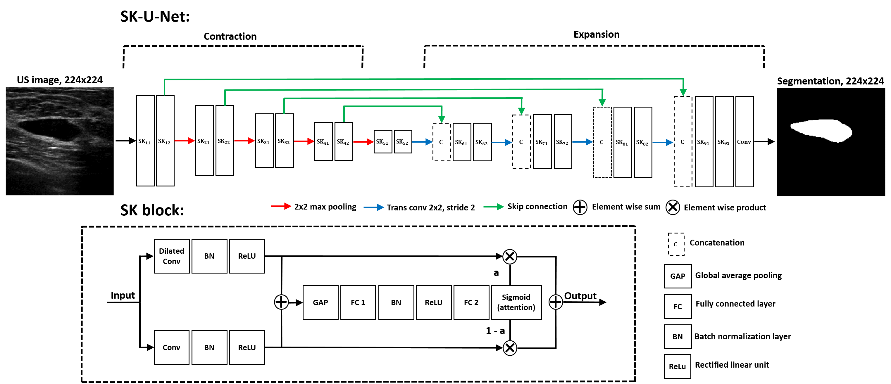

## Breast mass segmentation in ultrasound (in construction) 

This site describes how to use the selective kernel U-Net (SK-U-Net) for breast mass segmentation in ultrasound imaging. We provide several examples that might be useful for other researchers interested in this topic. 

# Methods 

Architecture of the SK-U-Net is presented below: 

# About 

If you find this site useful for your work, consider citing our paper ([bibtex](data/byra_bus_seg.txt)) : 

- [M. Byra, P. Jarosik. A. Szubert, M. Galperin, H. Ojeda-Fournier, L. Olson, M. O'Boyle, C. Comstock, M. Andre. Breast mass segmentation in ultrasound with selective kernel U-Net convolutional neural network. Biomedical Signal Processing and Control, 2020](https://doi.org/10.1016/j.bspc.2020.102027)

# Libs

- Keras 2.2.4
- TensorFlow 1.10.0
- cv2 3.1.0
